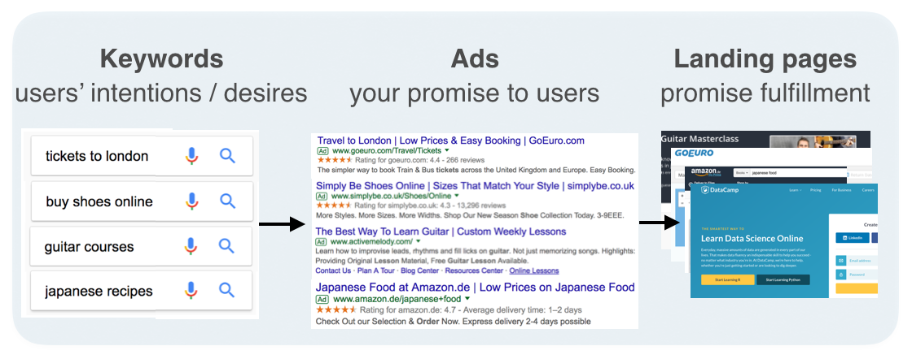

```{r setup, include=TRUE}
library(reticulate)
#knitr::opts_chunk$set(echo = TRUE,  cache = T, message = FALSE, warning = FALSE, engine.path='/Users/iPhuoc/anaconda/bin/python3/')
knitr::opts_chunk$set(echo = TRUE,  cache = F, message = FALSE, warning = FALSE)
use_python('/Users/iPhuoc/anaconda/bin/python3/')
knitr::knit_engines$set(python = reticulate::eng_python)
```

```{python, cache=FALSE}
import numpy as np
import pandas as pd
import matplotlib.pyplot as plt
import seaborn as sns
```


**Project Description**


You work for a digital marketing agency, which is approached by a massive online retailer of furniture. You are tasked with creating a prototype set of keywords for search campaigns for their sofas section. With your Python skills, you will efficiently create these keywords!

The most important task in structuring a search engine marketing account is mapping the right keywords to the right ads and making sure they send users to the right landing pages. Having figured that out is a big part of the account setup and makes the life of the account manager much easier.


```{r, echo=FALSE, out.width = "500px" }
library(knitr)

```


# The brief


**Task 1: Instructions**

Create a list of words to pair with products.


- Create a list of six to ten strings named words that contain `words` you think would work well with the products in the brief. If you're stuck, here are six words that would work: buy, price, discount, promotion, promo, and shop.
- Print `words` to inspect your newly-created list.

```{python}
# List of words to pair with products
words = ["buy", "price", "discount", "promotion", "promo", "shop"]

# Print list of words
print(words)
```


# Combine the words with the product names

**Task 2: Instructions**


Combine words and products.

- Create an empty list named `keywords_list`.
- Loop through all `products`.
- Loop through all `words`.
- Append `product`, and `word` and `product` joined by a space.


```{python}
products = ['sofas', 'convertible sofas', 'love seats', 'recliners', 'sofa beds']

# Create an empty list
keywords_list = []

# Loop through products
for product in products:
    # Loop through words
    for word in words:
        # Append combinations
        keywords_list.append([product, product + ' ' + word])
        keywords_list.append([product, word + ' ' + product])
        
# Inspect keyword list
from pprint import pprint
pprint(keywords_list)
```


# Convert the list of lists into a DataFrame


**Task 3: Instructions**

Convert the list into a DataFrame.


- Load the `pandas` library aliased as `pd`.
- Create a DataFrame named `keywords_df` from `keywords_list` using the `pandas` `from_records()` method. Don't specify column names yet.
- Inspect the contents of `keywords_df` using the `head()` method.

```{python}
# Load library
import pandas as pd

# Create a DataFrame from list
keywords_df = pd.DataFrame.from_records(keywords_list)

# Print the keywords DataFrame to explore it
print(keywords_df.head())
```


# Rename the columns of the DataFrame


Before we can upload this table of keywords, we will need to give the columns meaningful names. If we inspect the DataFrame we just created above, we can see that the columns are currently named  0 and 1. Ad Group (example: "sofas") and Keyword (example: "sofas buy") are much more appropriate names.


**Task 4: Instructions**

Give `keyword_df` more descriptive column names.

- Rename column `0` to `Ad Group` and column `1` to `Keyword`.


```{python}
# Rename the columns of the DataFrame
keywords_df = keywords_df.rename(columns={0: 'Ad Group', 1: 'Keyword'})
```


# Add a campaign column


Now we need to add some additional information to our DataFrame. We need a new column called Campaign for the campaign name. We want campaign names to be descriptive of our group of keywords and products, so let's call this campaign 'SEM_Sofas'.


**Task 5: Instructions**

Add a column to include the campaign name.

- Add a new column called `Campaign` with the value `'SEM_Sofas'` in every row.


```{python}
# Add a campaign column
keywords_df['Campaign']='SEM_Sofas'
```


# Create the match type column


There are different keyword match types. One is exact match, which is for matching the exact term or are close variations of that exact term. Another match type is broad match, which means ads may show on searches that include misspellings, synonyms, related searches, and other relevant variations.

Straight from Google's AdWords documentation:

>In general, the broader the match type, the more traffic potential that keyword will have, since your ads may be triggered more often. Conversely, a narrower match type means that your ads may show less often—but when they do, they’re likely to be more related to someone’s search.

Since the client is tight on budget, we want to make sure all the keywords are in exact match at the beginning.


**Task 6: Instructions**

Add a column to include the match criterion.

- Add a new column called `Criterion Type` with the value `'Exact'` in every row.

```{python}
# Add a criterion type column
keywords_df["Criterion Type"] = "Exact"
```


# Duplicate all the keywords into 'phrase' match


The great thing about exact match is that it is very specific, and we can control the process very well. The tradeoff, however, is that:

1. The search volume for exact match is lower than other match types
2. We can't possibly think of all the ways in which people search, and so, we are probably missing out on some high-quality keywords.


So it's good to use another match called phrase match as a discovery mechanism to allow our ads to be triggered by keywords that include our exact match keywords, together with anything before (or after) them.

Later on, when we launch the campaign, we can explore with modified broad match, broad match, and negative match types, for better visibility and control of our campaigns.


**Task 7: Instructions**

Create phrase match keywords.

- Change the `Criterion Type` column values of the newly copied DataFrame `keyword_phrase` to `'Phrase'`.
- Append the two DataFrames vertically so you can have one final DataFrame containing both. Name the new DataFrame `keywords_df_final`.


```{python}
# Make a copy of the keywords DataFrame
keywords_phrase = keywords_df.copy()

# Change criterion type match to phrase
keywords_phrase["Criterion Type"] = "Phrase"

# Append the DataFrames
keywords_df_final = keywords_df.append(keywords_phrase)
```


# Save and summarize!


To upload our campaign, we need to save it as a CSV file. Then we will be able to import it to AdWords editor or BingAds editor. There is also the option of pasting the data into the editor if we want, but having easy access to the saved data is great so let's save to a CSV file!

Looking at a summary of our campaign structure is good now that we've wrapped up our keyword work. We can do that by grouping by ad group and criterion type and counting by keyword. This summary shows us that we assigned specific keywords to specific ad groups, which are each part of a campaign. In essence, we are telling Google (or Bing, etc.) that we want any of the words in each ad group to trigger one of the ads in the same ad group. Separately, we will have to create another table for ads, which is a task for another day and would look something like this:


**Task 8: Instructions**


Save the DataFrame to a CSV file.

- Save `keywords_df_final` to a CSV file named `'keywords.csv'` using the `pandas` `to_csv()` method. Exclude the DataFrame index in the saved file by specifying `index=False`.


```{python}
# Save the final keywords to a CSV file
keywords_df_final.to_csv('keywords.csv', index=False)

# View a summary of our campaign work
summary = keywords_df_final.groupby(['Ad Group', 'Criterion Type'])['Keyword'].count()
print(summary)
```

